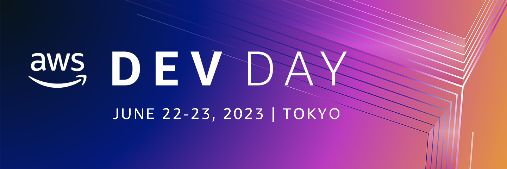

# AWS Dev Day Online Japan 2023 Call for Proposals

  

AWS が開催する開発者のための技術の祭典「AWS Dev Day 2023 Japan」では幅広く開発者の皆様から発表していただく「Call for Proposal」をプログラムに取り入れています。 みなさまが培われたご経験、知見、そしてノウハウをぜひこの場で共有していただけませんか？ ご応募をご検討いただける場合は下記募集要項をご確認いただき、応募フォームにセッション情報を入力してください。また、ご応募された方のご連絡先などの情報を別フォームにご記入いただきます。ご応募いただいたのち、選考を経て採否を決定させていただきます。予めご了承ください。

:pencil: [セッション応募フォームはこちら](https://github.com/aws-events/aws-dev-day-online-japan-2023-cfp/issues/new/choose)

:rocket: [現在の応募済みセッション一覧はこちら](https://github.com/aws-events/aws-dev-day-online-japan-2023-cfp/issues)

### 応募条件

1. アプリケーション開発の一般的なトピックもしくはAWS を活用した開発に関するトピックであること
2. AWS Dev Day 2023 Japan 会期中 (2023年 6月 22 日 ~ 23 日) のいずれの日程および時間帯 (13:00 ～ 19:00)でもプレゼンテーションできること。また、会場（東京都渋谷区）でのプレゼンテーションができること
3. 下記に定義したトピックや技術カテゴリのいずれかに、開発者の視点から関係していること (複数にまたがっていても問題ありません)
  - トピック
    - Web フロントエンド開発
    - Web バックエンド / サーバーサイド開発
    - モバイル / ネイティブアプリケーション開発
    - SaaS 開発
    - Game 開発
    - 大規模サービス構築
    - DevOps / Infrastructure as Code
    - プログラミング
    - アプリケーションアーキテクチャー
    - ソフトウェアテスト
    - エンジニアリングプロセス
    - エンジニアのキャリア
    - エンジニア組織のカルチャー
  - 技術カテゴリ
    - サーバーレス
    - コンテナ
    - フロントエンド
    - AI / 機械学習
    - データベース
    - アナリティクス
    - IoT
    - Web3/ブロックチェーン
4. 有効とみなされたご応募について、**セッションタイトル、アブストラクト、などの応募内容が GitHub 上で公開され、SNS を介してシェアされることに同意していただけること**
5. メールを利用した事務局とのコミュニケーションが可能であること
6. プレゼンテーションの後でAsk the Speakerに参加していただけること
7. セッション資料を事前(2023年6月1日まで）に提出していただけること
8. セッション資料の会期後の公開（投影用と多少異なっていてもかまいません）、動画の公開に同意していただけること
9. 当ページのフォームを使用し応募登録を完了していること。また、同様に[イベント登録規約](https://aws.amazon.com/events/terms/)、および [AWS 行動規範 Code of Conduct](https://aws.amazon.com/codesofconduct/) に同意していること

### セッション時間
下記よりお選びください(応募フォームで選択いただきます)
- 20分
- 45分
- 90分

### 応募締切

2023 年 4月 21 日（金）23:59 JST

### 選考方法

1. AWS Dev Day Online Japanコアメンバーによる審査
2. **GitHubへのリアクション数**

1, 2 を総合的に判断し、採否を決定いたします

### 選考結果のお知らせ

2023年 5 月 1日（月）前後を予定しております。  
選考結果につき、セッション応募時にご入力いただいたメールアドレス宛にご連絡します。

### FAQ

**Q.1人で複数のCFP の応募は可能ですか?**

A. 可能です。また、2回目以降のCFP では連絡先の登録は不要です。

### 過去のAWS Dev Day Online CFP採択セッションの例 (AWS Dev Day Online Japan 2022)

また、こちらから[AWS Dev Day Online Japan (2022)の動画](https://youtube.com/playlist?list=PLzWGOASvSx6Htjm-P2nu65yfJ9mAT3hoG)をご覧いただくことができます。

皆様のご応募を心よりお待ちしております
